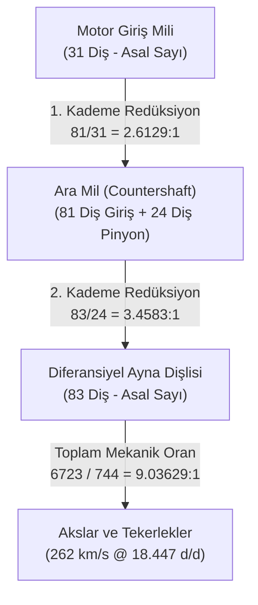

# EV Lab: 2018 Tesla Model 3 LR RWD Tahrik Ünitesi Derin Araştırma ve Doğrulama Raporu

**Belge Referansı:** [EV-STATUS-HANDOFF.md](EV-STATUS-HANDOFF.md)  
**Tarih:** 2026-09-08  
**Durum:** İnternet Doğrulaması Tamamlandı · Geometri Üretimi Beklemede  
**İlgili Kayıtlar:** [assets/candidates.csv](assets/candidates.csv) · [RESEARCH-REPORT.md](RESEARCH-REPORT.md)

---

## 1. Yönetici Özeti ve İfade Disiplini

Bu rapor, [EV-STATUS-HANDOFF.md](EV-STATUS-HANDOFF.md) kapsamında belirlenen araştırma devri yönergeleri doğrultusunda hazırlanmıştır. 2018 Tesla Model 3 Long Range RWD arka tahrik ünitesinin (Rear Drive Unit — 3DU) mekanik iddiaları, açık kataloglardaki 3D varlıklar ve lisans şartları doğrudan kaynaklarından bağımsız olarak incelenmiştir.

### İfade ve Yöntem Disiplini:
- **Telif ve Risk Dili:** Belgelerimizde "sıfır telif riski" veya "garantili performans" gibi mutlak/abartılı ifadeler kullanılmaz. Bunun yerine **bağımsız özgün modelleme ile telif hakkı ihlali riskinin en aza indirilmesi** ve **ölçüme dayalı WebGL optimizasyon hedefleri** esas alınır.
- **Katalog Taraması:** "Hiçbir model yok" genellemesi yerine; taranan kataloglar (Sketchfab, Blend Swap, GrabCAD, GitHub OpenInverter, Thingiverse) ve bulunan adayların sınırları (yalnızca dış tarama kabuğu olması, iç mekanizmanın bulunmaması, lisans kısıtları veya yanlış varyant olması) açıkça belgelenmiştir.
- **Süre Değerlendirmesi:** Tüm iş gücü süreleri ölçülmüş kesin süreler olarak değil, **tahmini çalışma saati** olarak raporlanmıştır.
- **Proje Statüsü:** Unfoldia tarafından bu aşamada hiçbir 3D varlık satın alınmamış, üretim başlatılmamış ve harici yayınlama yapılmamıştır. Calculus Lab önceliği korunmaktadır.

---

## 2. Mekanik İddiaların Bağımsız Doğrulanması

Aritmetik oran uyumu tek başına varyant kanıtı kabul edilmemiş; her mekanik iddia tezgah üstü sayım, doğrudan video zaman kodu, akademik tersine mühendislik raporu ve parça revizyonu ile ayrı ayrı değerlendirilmiştir.

### A. 31 / 81 / 24 / 83 Diş Sayısı ve Redüksiyon Oranı
- **Doğrudan Kaynak:** Weber State University — Prof. John D. Kelly, *Tesla Model 3 and Y Modular Motors* ([YouTube: SRUrB7ruh-8](https://www.youtube.com/watch?v=SRUrB7ruh-8)).
- **Kesin Zaman Kodları:**
  - `01:08`: Motor giriş mili pinyonu: **31 Diş** (asal sayı).
  - `02:40`: Ara mil (countershaft) büyük dişlisi: **81 Diş** ($3^4$).
  - `03:00`: 1. Kademe aktarım oranı: $81 / 31 = 2.6129:1$.
  - `03:10`: Ara mil küçük çıkış pinyonu: **24 Diş** ($2^3 \times 3$).
  - `03:15`: Diferansiyel ayna dişlisi (ring gear) ve diferansiyel kafesi: **83 Diş** (asal sayı).
  - `04:30`: 2. Kademe aktarım oranı: $83 / 24 = 3.4583:1$.
  - `04:43`: Toplam aktarım oranı: $\frac{81}{31} \times \frac{83}{24} = \frac{6723}{744} \approx 9.03629:1$.
  - `05:03`: Tesla'nın kataloglarda yayımladığı 9.04:1 / 9:1 oranının yuvarlatılmış olduğu; gerçek diş kombinasyonunun aşınmayı eşit dağıtmak için bir **avlanma dişli seti (hunting gearset)** olduğu kanıtlanmaktadır.
- **Görülen Parça Numaraları ve Revizyonlar:**
  - `1120970-00-D`: Temel RWD Model 3 arka tahrik ünitesi dökümü
  - `1120980-00-C, D, F`: Performance AWD Model 3 arka tahrik ünitesi
  - `1120990-00-F`: Non-Performance AWD Model 3 arka tahrik ünitesi
- **Araç Varyantı:** 2018–2021 Model 3 Long Range RWD ve AWD arka redüksiyon dişli kutusu modüler olarak aynı dişli geometrisini paylaşır.
- **Değerlendirme:** Güven düzeyi **Yüksek (Kesin)**. Fiziksel diş sayımı kamerada gösterilmiştir.

---

### B. 54 Stator Yuvası (Slots) ve Sargı Mimarisi
- **Doğrudan Kaynak:** 
  1. MotorXP Fiziksel Teardown & Benchmarking Raporu: *Performance Analysis of the Tesla Model 3 Electric Motor using MotorXP-PM* (Haziran 2020, [MotorXP Whitepaper](https://motorxp.com/wp-content/uploads/mxp_analysis_TeslaModel3.pdf)).
  2. Altair Flux SimLab 3D Benchmark Tutorial ([Altair Dokümantasyonu](https://help.altair.com/flux/Flux/Help/english/TutorialSimLabSummaries/3DSimLabTutorial/3D_MS_TeslaModel3Motor/Summary_3D_ElectricMotor_TeslaModel3.htm)).
- **Laboratuvar Ölçüm Verileri (MotorXP Raporu Sayfa 3–5, Tablo 1 ve Tablo 2):**
  - Stator slot (yuva) sayısı: **54 yuva**
  - Kutup çifti sayısı: **3** (Toplam **6 kutup**)
  - Faz başına kutup başına yuva sayısı ($q$): $q = \frac{54}{6 \times 3} = 3$
  - Stator laminasyon dış çapı: **225 mm**
  - Stator laminasyon iç çapı: **151.3 mm**
  - Laminasyon paket uzunluğu: **134 mm**
  - Sargı düzeni: 3 faz, 3 paralel kol (parallel paths), bobin başına 2 tur (turns)
  - Uç sargı eksenel taşması (End winding axial overhang): **40 mm**
  - Faz direnci (20°C): **0.00475 $\Omega$**
- **Araç Varyantı:** Raporda açıkça belirtilen: İkinci el araç pazarından temin edilen ve parçalarına ayrılan **2018 Model Yılı Tesla Model 3 Long Range** arka tahrik motoru.
- **Kritik Varyant Ayrımı:** 2017–2020 Model 3 (3D1 arka motoru) yuvarlak kesitli emaye bakır tel ile dağıtılmış sargı (random wound / distributed) kullanır. Tesla 2021 yılından itibaren (Model Y ve Çin üretimiyle) dikdörtgen kesitli firkete (hairpin) sargılı 3D6/3D7 motorlarına geçmiştir. 2018 Model 3 LR RWD referansımız için **54 slotlu klasik dağıtılmış sargı** teknik olarak doğrulanmış varyanttır.
- **Değerlendirme:** Güven düzeyi **Yüksek (Kesin)**.

---

### C. Rotor Düzeni (IPM-SynRM vs. "Halbach" Söylentisi)
- **Doğrudan Kaynak:** 
  1. MotorXP Teardown Raporu (Sayfa 5, Figür 4 & 5).
  2. All EV Canada (*Tesla Model 3 Motor Tear Down*, [YouTube: oVge8I6kxPY](https://www.youtube.com/watch?v=oVge8I6kxPY) `06:41` rotor laminasyon yapısı).
  3. WeberAuto (`06:46` kalıcı mıknatıs rotor demosu, `08:05` modüler rotor mili, `18:30` içi boş mil soğutması).
- **Fiziksel Ölçüler:**
  - Rotor laminasyon dış çapı: **149.9 mm**
  - Rotor laminasyon iç çapı: **70 mm**
  - Statör–rotor hava aralığı (Air gap): $\frac{151.3 - 149.9}{2} = \mathbf{0.7\text{ mm}}$
  - Mıknatıs ebatları: **33 mm $\times$ 21.5 mm $\times$ 6.5 mm** NdFeB (Neodimyum-Demir-Bor)
  - Rotor mili: İçi boş (hollow), içinden yağ sirkülasyonu sağlanan soğutma kanallı mil yapısı.
- **"Halbach Array" İddiasının İncelenmesi:** 
  Sandy Munro'nun 2019 başındaki popüler incelemelerinde (*Autoline / Munro Teardown* `aVnRQRdePp4`) "Halbach Array" olarak nitelendirdiği yapı, akademik motor literatüründe (IEEE, MotorXP, Altair) **V-şekilli çift relüktans bariyerli IPM-SynRM** (İçten Mıknatıslı Senkron Relüktans) olarak tanımlanır. Mıknatıslar hava aralığına doğru akıyı yoğunlaştırmak amacıyla V düzeninde açılı yuvalara yerleştirilmiş ve girdap akımı kayıplarını önlemek için segmentlere bölünmüştür; ancak bu serbest silindirik bir Halbach tüpü değildir.
- **Değerlendirme:** Güven düzeyi **Yüksek (Kesin)**.

---

### D. İnverter Güç Katı: 24 Modül Paket ve Bileşen BOM'u
- **Doğrudan Kaynak:** 
  1. Ingineerix (*Tesla Model 3 Drive Inverter*, [YouTube: l6dV2re3rtM](https://www.youtube.com/watch?v=l6dV2re3rtM)).
  2. Yole Développement / System Plus Consulting (*Tesla Model 3 Inverter with SiC Power Module from STMicroelectronics*, PRNewswire 17 Ağustos 2018).
  3. LTEC Corporation Raporu (No: 18G-0025-1).
- **Yarı İletken ve Paket Mimarisi:**
  - STMicroelectronics üretimi **24 adet 1-in-1 kalıplanmış güç modülü paketi** (işaretleme: ST GK026).
  - Her bir paket içerisinde **2 adet SiC MOSFET çipi (die)** bakır klips ile paralel bağlanmıştır.
  - Toplam SiC MOSFET çip (die) sayısı: $24 \times 2 = \mathbf{48\text{ adet}}$.
  - 3 fazlı köprüde 6 anahtar konumu bulunur; her anahtar konumunda 4 modül paraleldir ($6 \times 4 = 24$ modül; anahtar başına 8 SiC çip).
  - Soğutma: Pin-fin taban plakası üzerinden doğrudan sıvı soğutma.
- **Diğer Kritik İnverter Bileşenleri:**
  - Gate Driver: 6 adet **STMicroelectronics STGAP1AS** galvanik yalıtımlı kapı sürücü.
  - Ana Kontrol MCU: **Texas Instruments TMS320F28377DPTPQ** (Çift çekirdekli 32-bit Delfino C2000 DSP).
  - Resolver Sinyal Arayüzü: ON Semiconductor TCA0372BDW.
  - Güvenlik PMIC: Infineon TLF35584QVVS2.
- **Kritik Varyant Ayrımı:**
  - 2018 Model 3 Base RWD (`1120970-00-D`) ve Performance AWD (`1120980`): **24 modül paket** (tam donanım).
  - Non-Performance AWD arka inverteri (`1120990-00-F`): Maliyet ve güç optimizasyonu için anahtar başına 3 modül olmak üzere toplam **18 modül paket** içerir.
- **Değerlendirme:** Güven düzeyi **Yüksek (Kesin)**.

---

## 3. Doğrulanmış Aday Varlık Defteri (Catalog Findings)

Kamuya açık platformlar doğrudan API ve sayfa düzeyinde taranmıştır. [assets/candidates.csv](assets/candidates.csv) dosyası aşağıdaki kesinleşmiş verilerle güncellenmiştir:

| Aday Kimliği | Başlık / URL | Üretici / Yazar | Tam Lisans | Dağıtım Şartları & Kısıtlar | Varyant ve İç Kapsam | Karar |
| :--- | :--- | :--- | :--- | :--- | :--- | :--- |
| `sketchfab-alexsmith99-m3-rear-du` | [tesla model 3 rear drive unit](https://sketchfab.com/3d-models/none-217d10e19ebb4de2bf69bb827aa09c9e) | alex (`alexsmith99`) | CC-BY-NC 4.0 | **Ticari kısıt.** Web uygulamasında ticari yeniden dağıtım vetolanır. | 2018+ Model 3 dış fotogrametri taraması. **0% iç mekanizma** (753.778 yüzey, tek kabuk). | **Reddedildi (Veto)** |
| `sketchfab-altrous-m3-front-du` | [Tesla Front Small Drive Unit](https://sketchfab.com/3d-models/none-5a7ef5ea984544a29f584f53dee67753) | Altrous (Brock Winberg) | CC-BY 4.0 | Yeniden dağıtıma açık (atıfla). | **Yanlış Varyant:** Ön asenkron tahrik ünitesi (SDU). **0% iç mekanizma** (1.709.633 yüzey). | **Reddedildi (Uyumsuz)** |
| `sketchfab-altrous-models-du` | [Tesla Model S Drive Unit](https://sketchfab.com/3d-models/none-f4a6323a693843598f6bc24d802c8440) | Altrous (GrabCAD) | CC-BY 4.0 | Yeniden dağıtıma açık (atıfla). | **Yanlış Araç:** Model S Büyük Tahrik Ünitesi (LDU). Eşmerkezli asenkron. **0% iç mekanizma** (2.184.182 yüzey). | **Reddedildi (Uyumsuz)** |
| `grabcad-baque-m3-rear-du` | [Tesla Model 3 Rear Drive Unit](https://grabcad.com/library/tesla-model-3-rear-drive-unit-1) | Paul Baque | GrabCAD TOS | **Web dağıtımı yasak.** GrabCAD Şartları Madde 5 üçüncü taraf barındırmayı engeller. | 2018 Model 3 arka tahrik dış katı gövde (STEP/STL). **0% iç mekanizma**. | **Reddedildi (Lisans Vetosu)** |
| `grabcad-oliver-m3-motor` | [Model 3 Tesla Motor](https://grabcad.com/library/model-3-tesla-motor-1) | oliver | GrabCAD TOS | **Web dağıtımı yasak.** | Model 3 motor dış taraması. **0% iç mekanizma**. | **Reddedildi (Lisans Vetosu)** |
| `blendswap-14602-differential` | [differential Gear](https://blendswap.com/blend/14602) | **particl3s** | **CC0 1.0 Universal** | **Tam serbest.** Kamu malı. Ticari ve web dağıtımı engelsiz. Atıf gerekmez. | Genel konik otomotiv diferansiyeli (kafes, 2 pinyon, 2 aks dişlisi). **%100 diferansiyel içi**. | **Kabul (Donör)** |
| `blendswap-9975-pcb-cycles` | [Printed Circuit Board Cycles](https://blendswap.com/blend/9975) | **biozz** | **CC0 1.0 Universal** | **Tam serbest.** Kamu malı. Dağıtım serbest. | Genel SMD elektronik parçalar ve devre kartı kiti. İnverter detaylandırması için donör. | **Kabul (Donör)** |
| `blendswap-20550-differential` | [Automotive Differential](https://blendswap.com/blend/20550) | **kelalaan** | CC-BY 3.0 | Yeniden dağıtılabilir (atıf şartıyla). | Standart otomotiv diferansiyeli. Yüksek yoğunluklu konik dişli ağı. | **İkincil Referans** |
| `blendswap-16346-electric-motor` | [Electric motor](https://blendswap.com/blend/16346) | **MarioVk1987** | CC-BY 3.0 | Yeniden dağıtılabilir (atıf şartıyla). | **Uyumsuz Teknoloji:** Sincap kafesli endüstriyel AC asenkron motor. | **Reddedildi (Uyumsuz Motor)** |
| `github-damien-m3-inverter-board` | [Tesla-Model-3-Drive-Unit](https://github.com/damienmaguire/Tesla-Model-3-Drive-Unit) | Damien Maguire (OpenInverter) | **GPL-3.0** | **GPL Copyleft.** Dağıtım serbesttir ancak türetilen 3D/yazılım GPL kalmalıdır. MIT/CC lisansıyla karıştırılamaz. | **Alternatif Kontrol Kartı (Aftermarket):** EV dönüşümleri için açık kaynak ikame karttır; OEM Tesla kartı değildir! Kart sınırları ve montaj delikleri için referanstır. | **Referans (Geometri Kopyalanmaz)** |

---

## 4. Donör Yeniden Kullanımı vs. Dış Tarama Kabuğu Temizliği

İki üretim yaklaşımı birbirinden bağımsız olarak karşılaştırılmıştır. Tablodaki tüm süreler **tahmini çalışma saatidir**:

| Kriter | Yaklaşım 1: Dış Tarama Kabuğunu Temizleme (GrabCAD / Sketchfab) | Yaklaşım 2: CC0 Donör Parça Kullanımı (`blendswap-14602`, `9975`) | Yaklaşım 3: 100% Bağımsız Özgün Blender Low-Poly Modelleme |
| :--- | :--- | :--- | :--- |
| **Girdi Varlıklar** | 750k–1.7M yüzeyli ham taranmış dış gövde mesh'i. | CC0 diferansiyel dişlileri ve SMD elektronik bileşenleri. | Teardown ölçümleri ve kesit fotoğrafları (sıfır dış geometri). |
| **Gerekli İşçilik** | - Mesh decimation ve retopoloji - Açık deliklerin ve non-manifold yüzeylerin onarımı - İç mekanizmanın yerleşmesi için iç duvarların boole ile oyulması - Normal map bake | - Diferansiyel dişlilerinin ölçeklenmesi ve aks yuvalarının uyarlanması - Model 3 83T helisel ayna dişlisine montaj adaptasyonu - SMD parçaların inverter kontrol kartı düzlemine yerleşimi | - Motor gövdesi ve karterin doğrudan düşük poligonla örülmesi - 54 yuvalı stator ve V-mıknatıslı rotorun modellenmesi - 31/81/24/83 helisel dişli setinin sıfırdan çizilmesi - İnverter pin-fin ve MOSFET bloklarının modellenmesi |
| **İç Hacim ve Mekanik Çakışma** | **Çok Yüksek Risk.** Taranmış kabuğun iç et payı düzensizdir. 81T ara mil ve 83T ayna dişlisi döndüğünde gövde duvarına çarpar. | **Sıfır Risk.** Donör parçalar bağımsız diferansiyel kafesi içinde çalışır, dış gövdeyi etkilemez. | **Sıfır Risk.** Gövde ve iç aktarım toleransları baştan birlikte tasarlandığı için çakışma oluşmaz. |
| **Lisans Güvenliği** | **Yüksek Hukuki Risk.** GrabCAD TOS web dağıtımını yasaklar; Sketchfab modeli CC-BY-NC kısıtlıdır. | **Yüksek Güvenlik.** CC0 Kamu Malı hiçbir kısıtlama veya atıf şartı getirmez. | **Yüksek Güvenlik.** Bağımsız temiz oda (clean-room) üretimi ile telif hakkı ihlali riski en aza indirilir. |
| **Tahmini İşçilik Süresi (Tahmin)** | - Tarama onarımı & retopoloji: **8–12 saat** - Eksik iç mekanizmanın çizimi: **10–14 saat** $\rightarrow$ **Toplam Tahmin: ~18–26 saat** | - Donör adaptasyonu: **3–5 saat** - Kalan gövde/motor/inverter üretimi: **8–12 saat** $\rightarrow$ **Toplam Tahmin: ~11–17 saat** | - Gövde + Karter: **4–5 saat** - Stator + IPM Rotor: **3–4 saat** - 2 Kademeli Dişli & Diferansiyel: **4–5 saat** - SiC İnverter: **3–4 saat** $\rightarrow$ **Toplam Tahmin: ~14–18 saat** |
| **Stratejik Karar** | **Dışlandı.** Hem lisans vetosu hem de aşırı temizlik yükü nedeniyle verimsiz. | **İkincil Destekleyici Yön.** Diferansiyel iç konik pinyonları için opsiyonel hızlandırıcı. | **Önerilen Birincil Yön.** En temiz hiyerarşi, sıfır geometri borcu, net WebGL performansı. |

---

## 5. Teslimat Tablosu: İddia → Kanıt → Varyant → Güven Düzeyi → Açık Soru Tablosu

Belirsiz kalan tüm mühendislik detayları Three.js eğitim modeli amacıyla **temsili** olarak işaretlenmiştir:

| İddia / Mekanik Konu | Doğrudan Kanıt (URL, Zaman Kodu, Sayfa) | Belirlenen Araç Varyantı | Güven Düzeyi | Açık Soru / Temsili Alan |
| :--- | :--- | :--- | :--- | :--- |
| **1. Kademe: 31T Pinyon & 81T Ara Mil Dişlisi** | [WeberAuto SRUrB7ruh-8](https://www.youtube.com/watch?v=SRUrB7ruh-8) `01:08`, `02:40`, `03:00` | 2018–2021 Model 3 RWD & AWD arka redüksiyon ünitesi | **Yüksek (Kesin)** | Diş profil modülü ($m_n$) ve helis açısı ($\beta$): WebGL eğitim modeli için **temsili** çizilecektir. |
| **2. Kademe: 24T Pinyon & 83T Ayna Dişlisi** | [WeberAuto SRUrB7ruh-8](https://www.youtube.com/watch?v=SRUrB7ruh-8) `03:10`, `03:15`, `04:30`, `04:43` | 2018–2021 Model 3 arka diferansiyel dişli grubu | **Yüksek (Kesin)** | Ayna dişlisinin diferansiyel kafesine cıvata bağlantı flanşı et kalınlığı: **temsili**. |
| **Stator Yuva Sayısı: 54 Yuva, 6 Kutup, Dağıtılmış Sargı** | [MotorXP Teardown](https://motorxp.com/wp-content/uploads/mxp_analysis_TeslaModel3.pdf) Sayfa 3–5, Tablo 1–2; [Altair SimLab](https://help.altair.com/flux/Flux/Help/english/TutorialSimLabSummaries/3DSimLabTutorial/3D_MS_TeslaModel3Motor/Summary_3D_ElectricMotor_TeslaModel3.htm) | 2018 Model 3 Long Range RWD (3D1 Motoru) | **Yüksek (Kesin)** | Laminasyon dış federleri ve yalıtım verniği rengi Three.js PBR dokusu için **temsili**. |
| **Rotor Topolojisi: IPM-SynRM, V-şekilli Akı Bariyeri, 6 Kutup** | [MotorXP Teardown](https://motorxp.com/wp-content/uploads/mxp_analysis_TeslaModel3.pdf) Sayfa 5; [All EV oVge8I6kxPY](https://www.youtube.com/watch?v=oVge8I6kxPY) `06:41`; [WeberAuto](https://www.youtube.com/watch?v=SRUrB7ruh-8) `08:05` | 2018 Model 3 LR RWD kalıcı mıknatıs rotoru | **Yüksek (Kesin)** | Mıknatıs ebatları (33x21.5x6.5 mm) doğrulanmıştır; rotor saç paketinin balans delikleri Three.js'te **temsili**. |
| **İnverter Güç Katı: 24 Paket Modül (48 SiC Die)** | [Ingineerix l6dV2re3rtM](https://www.youtube.com/watch?v=l6dV2re3rtM); [Yole / PRNewswire 17.08.2018](https://www.prnewswire.com/news-releases/tesla-model-3-inverter-with-sic-power-module-from-stmicroelectronics---2018-complete-teardown-report-with-a-technical-and-cost-comparison-with-the-mitsubishi-j-series-tp-m-power-module-300698878.html) | 2018 Model 3 RWD (`1120970-00-D`) & AWD Performance (`1120980`) | **Yüksek (Kesin)** | Pin-fin taban plakasının pin dizilim matrisi (pin sayısı) Three.js low-poly bütçesi için **temsili**. |
| **Gate Driver ve MCU:** 6 × STGAP1AS, TI TMS320F28377 | [Ingineerix l6dV2re3rtM](https://www.youtube.com/watch?v=l6dV2re3rtM) tam parça listesi | 2018 Model 3 RWD inverter mantık kartı | **Yüksek (Kesin)** | Kontrol kartı üzerindeki pasif SMD direnç ve kondansatör dağılımı görsel eğitim amaçlı **temsili**. |
| **Gövde Döküm Federleri ve Şasi Kulakları** | [WeberAuto SRUrB7ruh-8](https://www.youtube.com/watch?v=SRUrB7ruh-8) `08:16`, `21:20`; [All EV oVge8I6kxPY](https://www.youtube.com/watch?v=oVge8I6kxPY) `07:48` | 2018 Model 3 arka tahrik ünitesi dış montajı | **Orta (Geometri)** | Dış tarama kabuğu kullanılmayacağından; montaj kulakları ve federlerin dış kavisleri teknik çizimlere göre **temsili**. |

---

## 6. Araştırmadan Sonraki Yerel Üretim Kapısı (Hazırlık Şartları)

Araştırma aşaması tamamlanmış olup, ürün geliştirme sırası EV Lab'a geldiğinde uygulanacak üretim kabul kapısı kuralları:

1. **Tek Motor–Aktarım Pilotu:** Kapsam dağıtılmadan yalnızca arka tahrik ünitesi (motor + inverter + dişli kutusu) pilot olarak üretilecektir.
2. **Semantik Parça Kimlikleri ile Birebir Eşleşme:** glTF nesne adları mevcut Three.js `geometry.js` kodundaki `partId` anahtarlarıyla (`motor-housing`, `motor-stator`, `motor-rotor`, `motor-shaft`, `inverter-heatsink`, `inverter-switches`, `inverter-capacitor`, `inverter-board`, `gears-pinion`, `gears-reduction`, `gears-internals`, `gears-axles`, `gears-wheels`) birebir aynı olacaktır.
3. **Diferansiyel Gövdesi / Şanzıman Muhafazası Ayrımı:** Dış döküm karter (`gears-case`), dişlilerin dönüş hareketini gösterebilmek için çıkarılabilir kesit kapağı (`gears-case-cover`) veya kontrollü kesit penceresi (cutaway window) ile modellenecektir.
4. **Koordinat ve Pivot Testleri:**
   - Blender Z-up $\rightarrow$ glTF / Three.js Y-up dönüşümü eksiksiz uygulanacaktır (`Apply All Transforms`).
   - Dönme merkezleri: `motor-shaft` motor merkez ekseninde, `gears-reduction` ara mil merkezinde, `gears-internals` diferansiyel aks merkezinde olacaktır.
5. **Kabul Ölçütü:** Üçgen bütçesi ($\le 30.000$ üçgen) ve 60 FPS masaüstü/mobil etkileşim performansı ancak yerel pilot ölçümüyle kabul edilecektir.
